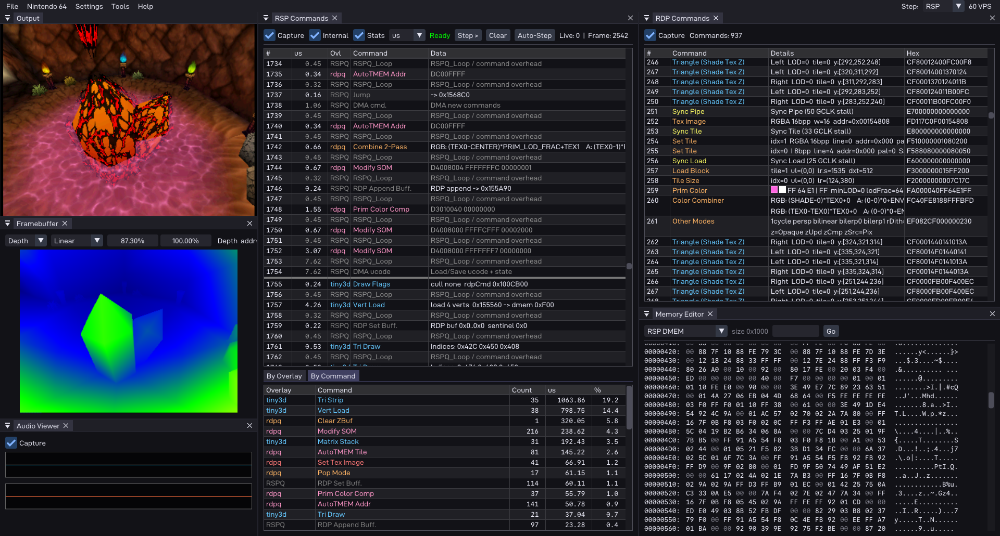

# Ares 64

[](https://github.com/higan-emu/ares/blob/master/LICENSE)



Original Repo: https://github.com/ares-emulator/ares

This is a special version of ares only containing the N64 core, with additional features geared towards developers.

If you plan on just playing games, please use the original repo.
If you want to improve accuracy or make changes to the N64 core itself, please also contribute upstream.

# Features

Additional features include (checkout the 'tools' menu):

- Framebuffer viewer that updates in realtime
  - Color / Coverage / Depth
  - Depth range can be tuned
  - Depth Histogram
  - Overdraw heatmap for depth/color
- RDP logging + single stepping
  - stepping updates the framebuffer in realtime
- RSP logging + single stepping (libdragon only)
  - stepping updates the framebuffer in realtime
  - supported commands can be decoded into readable arguments
  - metrics to measure RSP times
- TMEM viewer with tile preview
- Memory viewer and editor
- Audio visualizer
- rendering via ParallelRDP and angrylion (swappable mid-game)
- SD/HD/UHD for ParallelRDP changable mid-game
- UI that can be freely organized and is saved across starts

For single stepping, use the hotkey for frame-advance after pausing emulation.<br>
In the top-right you are also given the option what stepping mode is currently active.

Some features are only available with angrylion, you can select the renderer in the top-right.

# Build

Please make sure to also checkout all submodules via git.

## Requirements

- **CMake** 3.28 or later
- **C++23** compiler
- **SDL3** is bundled in `thirdparty/`, no system install needed

### CMake

```sh
cmake -B build -G Ninja -DCMAKE_BUILD_TYPE=Release
cmake --build build --target desktop-ui -j8
```

The binary will be at `build/desktop-ui/ares`.

For faster iterative builds, use:
```sh
cmake -S . -B build -DENABLE_IPO=OFF -DCMAKE_EXE_LINKER_FLAGS=-fuse-ld=lld -DCMAKE_SHARED_LINKER_FLAGS=-fuse-ld=lld
```

# Running

Start ares while having the working directory in this repo.<br>
You can pass the ROM as the argument:
```sh
./build/desktop-ui/ares /path/to/game.z64
```

For any commercial games that will be enough to get all features except RSP commands working.<br>
For libdragon ROMs, you can make sure to keep the `.elf` file around.<br>
Either next to the ROM, or in a `build` directory next to it.<br>
This will enable fetching labels used to figure out the overlay setup.<br>

## Adapting overlays

Some data that can't be fetched form the `.elf` will be loaded from a JSON file.<br>
To change this data checkout [rspq-libdragon.json](./desktop-ui/ui/rsp-overlays/rspq-libdragon.json).
After making changes, just rebuild ares.

For per-ROM changes, place this JSON next to the `.elf` file.

# Internal changes

If you are familiar with the original code of ares, some larger changes where made in this version.

All cores except N64 are gone.<br>
For the window itself, rendering, audio as well as input, SDL3 is now used.<br>
This means no more drivers and driver settings.<br>
For anything UI, imgui is used, so native UI toolkits are no longer needed.

The `hiro` code is completely deleted, `ruby` is only a few small wrappers around SDL3.<br>
In general, large portions of now unused code have been removed.

Rendering is now supported via ParallelRDP or angrylion, which can be changed while the game is running.

Keep in mind this project is still very much WIP, so many parts are still left-over and not removed yet (mostly options in UIs).

## Why so many changes?

Imgui is the perfect tool to make debugging UIs like this, at which point it makes little sense to draw the bit of menu UI with something else.<br>
Especially since it cuts out any platform specific code.<br>
SDL3 is the same story, by using the GPU API, rendering is abstracted from both OS and graphics API.<br>
Only vulkan remains as a requirement due to ParallelRDP.

The general code stripping is both due to reducing complexity, build size and compilation times.<br>

With other projects of mine ([Pyrite64](https://github.com/HailToDodongo/pyrite64)), i may also use this as a base for future "PC versions" of games.<br>
Where ROMs can be bundled with ares, and potentially include extended features / rendering.<br>
In which case a simpler version without driver settings becomes easier to manage.

The exception to this is the N64 core, besides hooks to make certain features work.<br>
Emulation itself is not touched, and should only be changed upstream.

## Updating from upstream

Due to the deletions, merge conflicts **will** happen.<br>
However they are easy to solve, for that reason a script is included to help with that.<br>
This will auto accept deleted files on our end, as well as completely changed files that only share the name still.<br>

Anything left are true conflicts independent of any refactors.<br>
Those can happen if changes near the added hooks where made.<br>
Always prefer the upstream code as close as possible, and adapt hooks and changes around it.

Before running the script, make sure you are on the `imgui` branch.<br>
The upstream remote must be setup and be called `origin`, this repo here must be a different remote name.

After that just run: `./scripts/pull-upstream.sh`.<br>
On either success or conflict, it will give further logging.

## Modified Repos

This project uses a modified and directly embedded version of angrylion.
The specific repo it is based on is: <https://github.com/Thar0/angrylion-rdp-plus>
Nothing of the rendering was changed, only new things added to capture metrics.